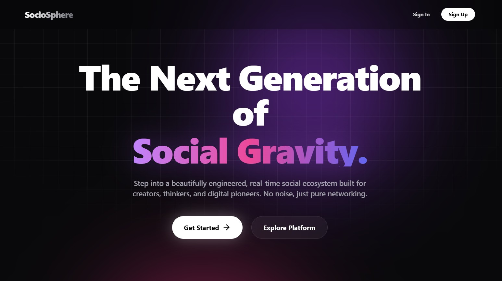
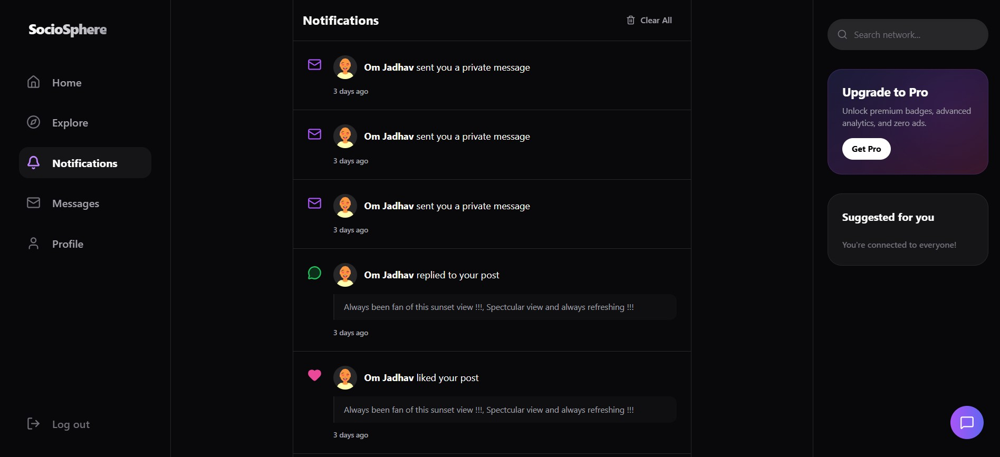

# SocioSphere

<div align="center">

### A refined social networking platform designed for realtime communication, rich content sharing, personalized engagement, and seamless digital connection.

[Features](#features) •
[Architecture](#architecture) •
[Tech Stack](#tech-stack) •
[Installation](#installation) •
[Roadmap](#roadmap)

</div>

---

## Overview

SocioSphere is a modern full-stack social networking platform crafted to deliver immersive connectivity, seamless interaction, and elegant digital experiences.

Built with a focus on performance, realtime communication, and thoughtful design, SocioSphere enables users to connect, share moments, engage with communities, and communicate instantly in a polished social ecosystem.

From dynamic feeds and rich user profiles to realtime messaging and intelligent notifications, every feature is engineered for modern social interaction.

---

## Showcase

<div align="center">

### Landing Experience


<br/><br/>

### Social Feed


<br/><br/>

### Messaging Experience


<br/><br/>

### User Profile


<br/><br/>

### Notifications Center


</div>

---

## Highlights

- Secure authentication & session management  
- Dynamic personalized social feed  
- Rich media post creation & sharing  
- Like, comment, and engagement system  
- Follow / unfollow user network  
- Realtime private messaging  
- Live notification center  
- Profile customization  
- User discovery & explore section  
- Cloud-based media storage optimization  
- Responsive premium UI / UX  

---

## Core Features

### Authentication
Robust authentication flow with secure login, protected routes, and persistent sessions.

### Dynamic Feed
A personalized social feed built for seamless browsing and interaction.

### Rich Profiles
Custom user identities with avatars, bios, links, location, and profile customization.

### Realtime Messaging
Instant one-to-one communication powered by WebSockets.

### Notifications
Live alerts for likes, comments, follows, and messages.

### Media Sharing
Optimized image uploads and delivery for high-quality content sharing.

### Social Engagement
Interactive ecosystem for likes, comments, sharing, and user connection.

---

## Architecture

```text
SocioSphere/
│
├── frontend/
│   ├── pages/
│   ├── components/
│   ├── store/
│   └── services/
│
├── backend/
│   ├── models/
│   ├── controllers/
│   ├── routes/
│   ├── middleware/
│   └── utils/
│
└── configuration/
```

---

## Tech Stack

### Frontend
- React
- Tailwind CSS
- Zustand
- Lucide Icons
- Socket.io Client

### Backend
- Node.js
- Express.js
- MongoDB
- Mongoose
- Socket.io
- JWT Authentication
- Bcrypt

### Cloud Services
- Cloudinary

---

## Engineering Principles

SocioSphere is built around:

- Scalability  
- Maintainability  
- Secure authentication  
- Realtime responsiveness  
- Modular architecture  
- Clean UI design  
- Performance-first rendering  

---

## Installation

### Clone repository

```bash
git clone https://github.com/yourusername/SocioSphere.git
cd SocioSphere
```

### Install dependencies

```bash
npm install
```

### Configure environment variables

Create `.env` files for frontend and backend.

Example:

```env
PORT=
MONGO_URI=
JWT_SECRET=
CLOUDINARY_CLOUD_NAME=
CLOUDINARY_API_KEY=
CLOUDINARY_API_SECRET=
```

### Run application

```bash
npm run dev
```

---

## Future Roadmap

- Voice & video communication  
- Story / reel system  
- Group communities  
- AI-powered recommendations  
- Dark / light adaptive themes  
- Advanced moderation tools  
- Push notifications  
- Mobile application support  

---

## Project Vision

SocioSphere aims to redefine digital interaction through elegant design, meaningful engagement, and realtime connected experiences.

---

<div align="center">

**Built with precision, engineered for connection.**

</div>
